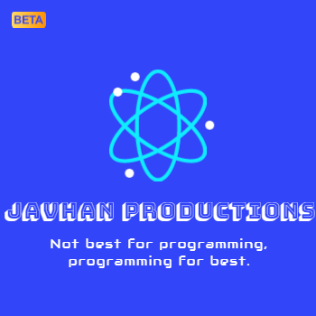

    

        
    

    <h1>Javhan</h1>

## About ℹ
This project is a open-source programming language based on java and other POO programming languages, this project also contains long terms support (LTS) and periodic updates.

## Developers 👷‍♂️
- [CiroDOS]("https://github.com/CiroDOS/" "Principal developer") - Principal developer

## Objectives 🏁
I want to generalize this programming language for be able to run in various devices, PC, Phone, Tablet and others.
This programming language will be focused on POO, MultiThreads and compatibily with much devices.

## How to develop? 💻
For develop this programming language requires languages such as 
   Java and others.
- Related: [Contributing](#contributing-♥)

## Contributing ♥
You can contribute to this project just [forking this repo](/fork "Fork this repo").
If you dont know how to make a fork, please visit the official guide of Github of [How to make a fork](https://docs.github.com/en/get-started/quickstart/fork-a-repo)

# Jash

## What is jash? It is related with Javhan?
Javhan contains other project called "Jash". This project IS related with Javhan.
It's a web library for working with javhan, similar to a applet. It is used to create instances of this programming language such as Applications, etc.

## Official Web page
[Go to the Official web page](https://javhan.github.io/)